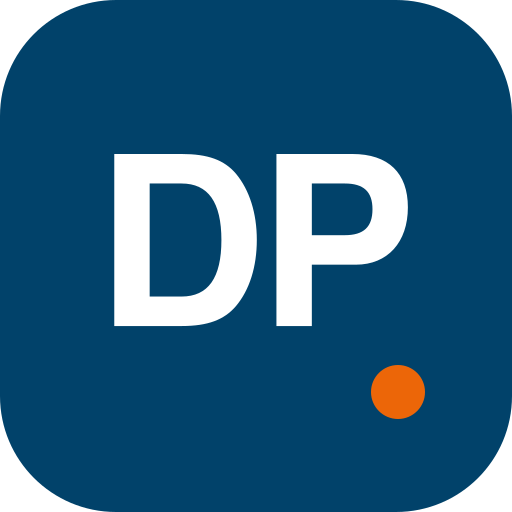

  

<h1 align="center">DeskPlan — marque &amp; iconographie</h1>

<em>Le nécessaire graphique pour représenter DeskPlan de façon cohérente : logo, déclinaisons, couleurs et formats prêts à l'emploi.</em>

---

## La marque

`logo.svg` est le **mark source** : le monogramme blanc **« DP »** sur un badge bleu X (`#01426A`), ponctué d'une **pastille orange X** (`#EC6608`) — clin d'œil au « **Plan** » du logotype.

La marque est **theme-safe** : le glyphe est blanc **sur le badge coloré**, jamais posé directement sur un fond blanc. Pour un fond clair sans badge, utiliser la déclinaison bleue ; pour un fond sombre ou une photo, la déclinaison blanche.

## Fichiers

| Dossier | Contenu |
|---|---|
| [`logo.svg`](logo.svg) | Mark source (badge couleur), vectoriel |
| [`svg/`](svg) | `deskplan-badge-color` · `deskplan-mark-navy` · `deskplan-mark-white` · `deskplan-wordmark` |
| [`png/`](png) | Badge rastérisé de 16 à 1024 px + `deskplan-wordmark.png` |
| [`avatar/`](avatar) | Avatar 512 px (photo de profil GitHub / réseaux) |
| [`social/`](social) | Bandeau 1280×640 (aperçu social / bannière de dépôt) |
| [`icns/`](icns) | Icône macOS (`DeskPlan.icns`) |

## Couleurs

| Rôle | Nom | Hex | Réf. |
|---|---|---|---|
| Primaire | Bleu X | `#01426A` | Pantone 7694 C |
| Fills / surfaces foncées | Bleu X foncé | `#012E49` | |
| Secondaire / mode sombre | Bleu X clair | `#2E6E96` | |
| Accent / CTA | Orange X | `#EC6608` | |
| Accent (mode sombre) | Orange X vif | `#FF7E2E` | |
| Bleus d'appoint | | `#6BA4D8` · `#9DC0DA` | |

Palette complète (surfaces sombres comprises) : [`colors.md`](colors.md).

## Usage

**À faire** — laisser une marge de dégagement autour de la marque au moins égale à la hauteur du « D » ; utiliser les fichiers vectoriels dès que possible ; respecter le couple bleu X / orange X.

**À éviter** — reproduire, incliner ou déformer le glyphe ; changer les couleurs ; poser la marque blanche sur un fond clair (ou l'inverse) ; ajouter ombres ou contours.

## Marques &amp; droits

« DeskPlan » et son iconographie sont des marques du **CPHT / CMLS — IDCS, École polytechnique**. Ces éléments graphiques identifient le projet ; merci de ne pas les réutiliser pour un autre produit ni de les modifier hors de ce dépôt.
